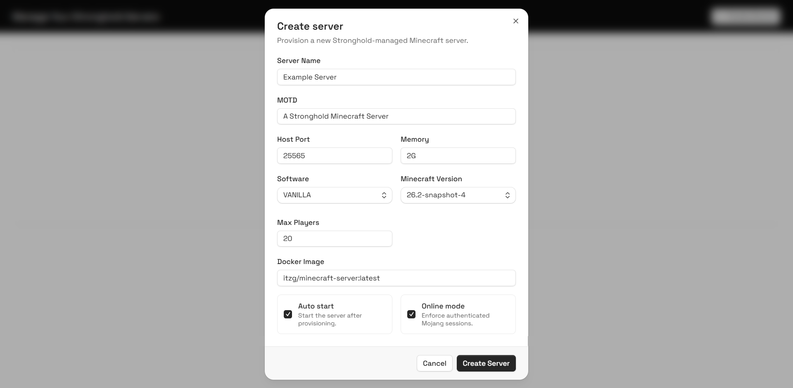
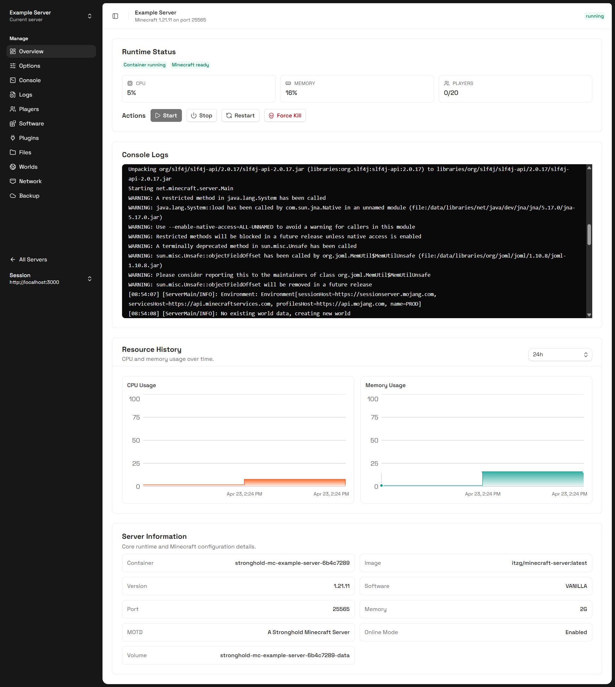
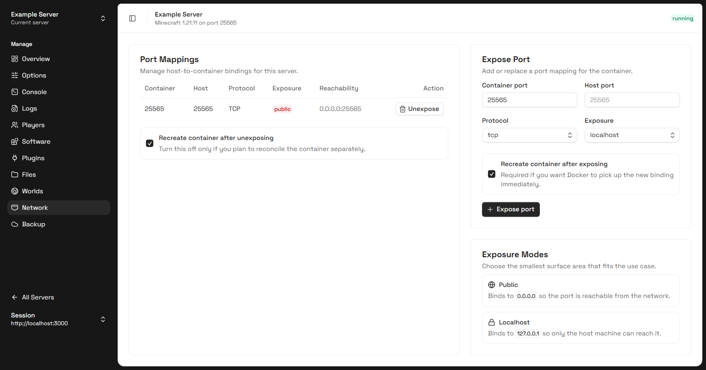

# Stronghold (Under Development)

Stronghold is a self-hosted control panel for provisioning and managing Minecraft servers.
It provides a web dashboard for server lifecycle actions and a backend service that handles configuration, status, and metadata.

## Tech Stack

- Runtime and Monorepo: Bun, Turborepo
- Frontend: React 19, React Router 7, Vite, Tailwind CSS 4
- Backend API: Elysia, tRPC, Zod
- Database: Drizzle ORM, Turso/libSQL (SQLite-compatible)
- Infrastructure: Docker-based server management

## Screenshots

